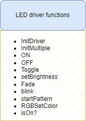

# stm32-led-driver
LED driver for STM32 MCUs. 




This code was tested using ***STM32F401CCU6***

# Usage Examples
## Basic LED control 
### 1. Turning LED ON or OFF
To turn on an LED, use the ```void LED_On(GPIO_TypeDef* PORT, uint16_t pin)```interface. Note that the LED pin must be initialized as
a GPIO output on the pin config tool.

#### Example code
```c
int main() {
    // turn on LED
    LED_On(TEST_LED_GPIO_Port, TEST_LED_Pin);
    HAL_Delay(1000);
    // turn off LED 
    LED_Off(TEST_LED_GPIO_Port, TEST_LED_Pin);
    HAL_Delay(1000);

    while(1) {
        // super loop
    }
}
```

### 2. Blocking Blink
A blink interfce is provided. This blink is blocking. ```void LED_Blocking_Blink(GPIO_TypeDef* PORT, uint16_t pin, uint16_t interval)```
It takes the port, pin and the delay length in ms.

#### Example code
```c
int main() {

    while(1) {
        LED_Blocking_Blink(TEST_LED_GPIO_Port, TEST_LED_Pin, 500);s
    }
}
```

### 3. De-initialize LED pin
De-initializing an LED pin is setting the pin to a floating state, such that it can be used for 
other purposes. 

#### Example code 
```c 
int main() {

    // de-initialize pin 
    void LED_Deinitialize(TEST_LED_GPIO_Port, TEST_LED_Pin)

    while(1) {
        // your code 
    }
}
```


## PWM Control
### 4. Fading 
Fading is done using PWM and Timers. Any timer can be configured to be used as a PWM generation output to a 
specific channel. This driver provides a ```LED_Fade()``` function that takes the following parameters:

| Parameter      | Type            | Description          |
|----------------|-----------------|----------------------|
| TIMER          | Tim_HandleTypedef*| Pointer to timer handle |
| CHANNEL        | uint16_t        | Timer channel number |
| steps          | uint16_t        | Number of steps      |
| delay_ms       | uint16_t        | Delay in milliseconds|

- **TIMER** represents the timer handle for the timer being used to fadde the given LED. Example ```&htim1```
- **CHANNEL** represents the channel connected to the specific LED. Example ```TIMER_CHANNEL_1```
- **Steps** indicate how fast or slow you want the fading to happen. A high value will make the fading less smooth, and a low value 
will make the fading smooth
- **delay_ms** indicate the length of delays between fading pulses. A high value will make the fading slow while a low 
value will make fading fast

Note that the PWM output must be started for that channel using the ```LED_PWM_Start(&htim2, TIM_CHANNEL_1);``` function as shown
below.

#### Example code 
```c 
int main() {
    //...
    LED_PWM_Start(&htim2, TIM_CHANNEL_1);
    //...

    while (1) {
        // fade LED with a delay of 20ms, step count of 10
        LED_Fade(&htim2, TIM_CHANNEL_1, 10, 20);

    }
}

```

### Extension 
Other fucntion to be added to this simple LED driver are:
- blink patterns (SOS, MORSE etc)
- RGB LED control 
- Diagnostics (Check is LED ON, or OFF, or floating)

## References 
1. [STM32 PWM Example - Timer PWM Mode Tutorial (DeepBlue Embedded)](https://deepbluembedded.com/stm32-pwm-example-timer-pwm-mode-tutorial/)

